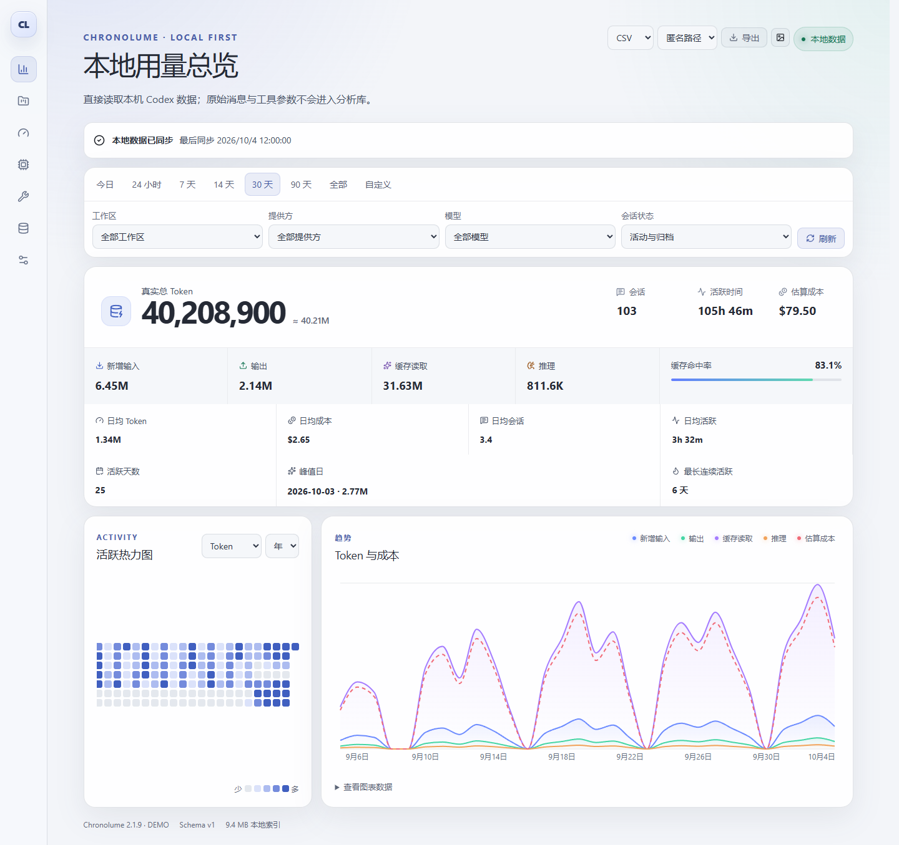
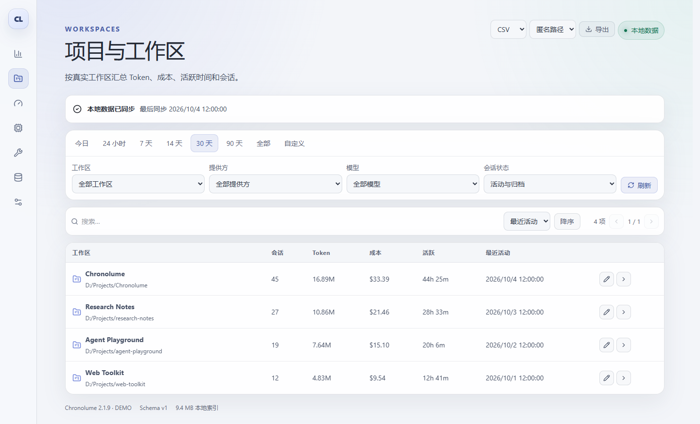
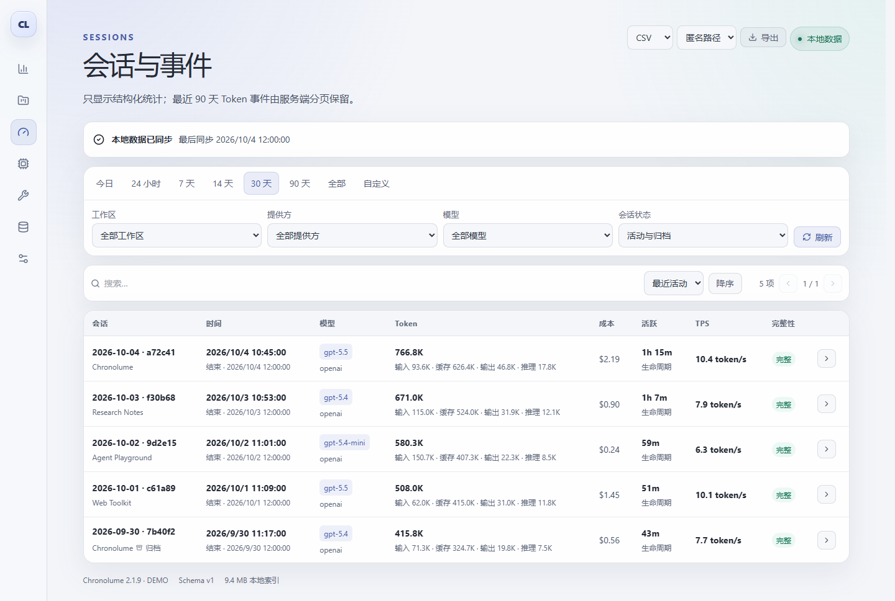
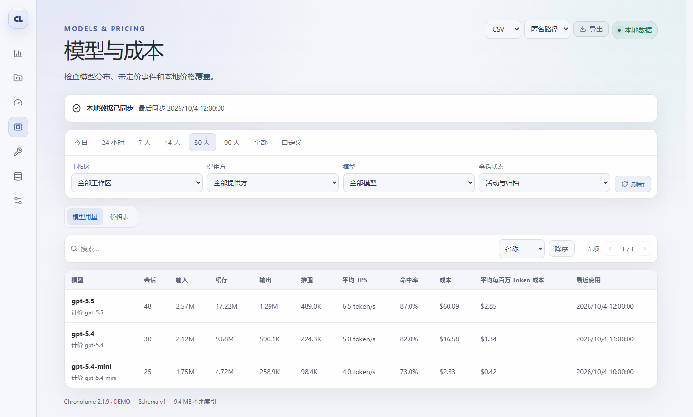
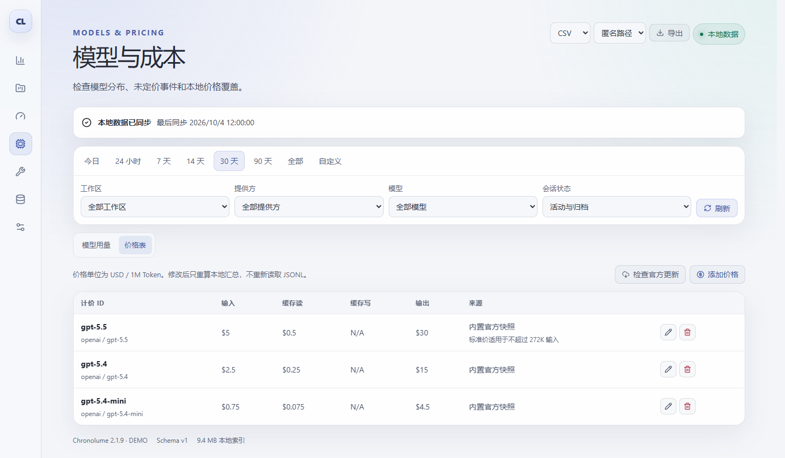
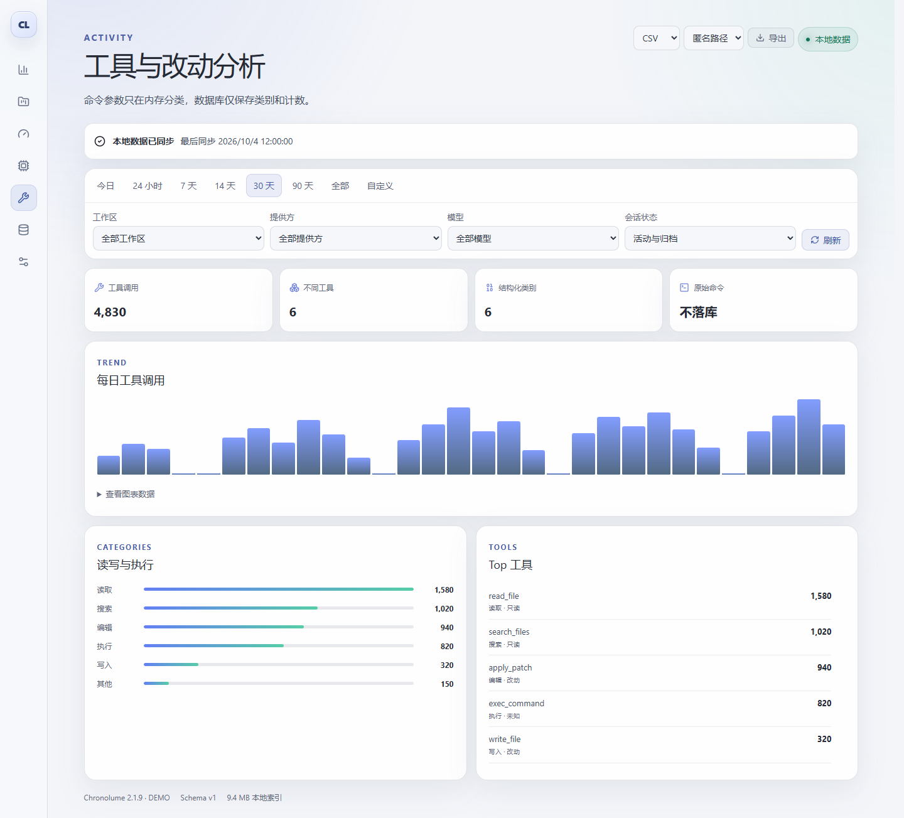

<p align="center">
  
</p>

<h1 align="center">Chronolume</h1>

<p align="center">
  <strong>让本地 Codex 数据，从一串日志变成你的工作节奏。</strong><br>
  <em>Illuminate the rhythm of your work.</em>
</p>

<p align="center">
  <a href="https://github.com/gaos6e/Chronolume/releases/latest"></a>
  <a href="#下载与开始"></a>
  <a href="docs/packaging-macos.md"></a>
  <a href="docs/privacy.md"></a>
</p>

<p align="center">
  <a href="https://github.com/gaos6e/Chronolume/releases/latest"><strong>下载 Windows 版</strong></a>
  · <a href="#下载与开始">快速开始</a>
  · <a href="#更多界面">更多界面</a>
  · <a href="docs/privacy.md">隐私说明</a>
  · <a href="#开发与构建">开发文档</a>
</p>

Chronolume 是为 **OpenAI Codex 用户**打造的本地洞察应用。只读扫描 `~/.codex`，将活动记录整理成 Token、会话、活跃时间、模型、工具与成本趋势。无需登录，默认离线；首次建立索引，之后增量同步。

<p align="center">
  <picture>
    <source media="(prefers-color-scheme: dark)" srcset="docs/images/chronolume-dashboard-dark.png">
    <source media="(prefers-color-scheme: light)" srcset="docs/images/chronolume-dashboard.png">
    
  </picture>
  <br>
  <sub>一眼看见用量、成本与工作节奏 · <a href="docs/images/chronolume-dashboard.png">浅色</a> / <a href="docs/images/chronolume-dashboard-dark.png">暗色</a>主题 · 截图使用演示数据</sub>
</p>

> 成本按 Token 用量与本地价格表估算，不等同于 OpenAI / ChatGPT 的官方账单、余额或在线配额。

## 下载与开始

| 平台与下载 | 当前状态 |
| :--- | :--- |
| **Windows x64** · [下载](https://github.com/gaos6e/Chronolume/releases/latest) | 安装器或便携 ZIP；依赖 WebView2 Runtime。安装器尚未签名，SmartScreen 可能显示提醒 |
| **macOS Universal** · [测试候选](https://github.com/gaos6e/Chronolume/releases/latest) | 带 `unsigned` 的 `.app.zip` / `.dmg` 仅供测试；正式分发等待签名、公证与真机验收 |

1. **下载安装**：Windows 选择安装器或便携版；macOS 候选版请先阅读[测试与分发说明](docs/packaging-macos.md)。
2. **打开应用**：自动扫描本机 `~/.codex`，在后台建立分析索引，可查看进度、取消或续传。
3. **查看与导出**：选择时间范围、工作区、提供方、模型和会话状态，查看自己的使用图景，或导出 CSV、JSON 与趋势 PNG。

无需改变原有 Codex 工作方式。应用不会接管请求、读取账号凭据或查询在线配额。

## 能做什么

| 你想了解的事 | Chronolume 提供的视角 |
| :--- | :--- |
| **最近工作得怎样？** | Token 构成、活跃时间、日均指标、峰值日、连续活跃天数、年度热力图与小时 / 日 / 周趋势 |
| **成本花在哪里？** | 模型用量、缓存命中率、平均 TPS、未定价提示，以及可编辑的本地价格表 |
| **哪些项目和会话最活跃？** | 工作区汇总、搜索与别名、会话详情和最近 90 天结构化事件；筛选条件贯穿页面与导出 |
| **工具做了哪些工作？** | 搜索、读取、写入、编辑与执行等类别的调用趋势和 Top 工具，保留计数，不保存命令正文 |

<details>
<summary><strong>查看完整功能清单</strong></summary>

- **时间与筛选**：今日、24 小时、7 / 14 / 30 / 90 天、全部历史，以及固定或实时自定义范围；支持工作区、提供方、模型和归档状态级联筛选。
- **总览与趋势**：Token 构成、缓存命中率、会话数、估算成本、活跃时间、峰值日、连续活跃天数、年度热力图和小时 / 日 / 周趋势。
- **项目与会话**：工作区搜索、别名、忽略、上下文导航；会话级 Token、成本、活跃度、平均 TPS、归档状态、完整性和最近 90 天结构化事件。
- **模型与价格**：模型分布、规范化计价 ID、未定价提示、本地价格增删改与恢复，以及用户主动触发的官方价格差异预览。
- **工具活动**：搜索、读取、写入、编辑、执行和其他等结构化分类，展示 Top 工具与每日趋势，不落库命令正文。
- **本地数据管理**：后台首次导入、真实进度、取消、断点续传、增量同步、修复、重建、诊断与清空派生分析库。
- **体验与导出**：中英文、浅色 / 暗色 / 系统主题、字体缩放、reduced-motion，以及不含对话正文的 CSV、JSON 和 PNG 导出。

</details>

## 更多界面

展开查看完整界面，点击图片查看原图。以下截图均来自当前前端，使用固定的演示数据，不包含个人日志；截图生成方法见[预览维护说明](docs/readme-preview.md)。

<details>
<summary><strong>项目与工作区</strong> · 对比投入，管理别名与统计范围</summary>

按工作区查看会话、Token、成本和活跃时间；可编辑别名，或直接打开该工作区的总览。

[](docs/images/chronolume-projects.png)

</details>

<details>
<summary><strong>会话与事件</strong> · 回看一次协作的结构化统计</summary>

对比模型、Token、活跃时间、平均 TPS 与完整性；详情展示结构化事件、活跃时间段和工具统计，不展示对话正文。

[](docs/images/chronolume-sessions.png)

</details>

<details>
<summary><strong>模型与成本</strong> · 对比模型用量、缓存与平均 TPS</summary>

查看模型分布、缓存命中率、估算成本和平均每百万 Token 成本。平均 TPS 按活跃时长加权，包含工具调用等等待时间。

[](docs/images/chronolume-models.png)

</details>

<details>
<summary><strong>本地价格表</strong> · 编辑价格，预览官方差异后再更新</summary>

价格单位为 USD / 1M Token。修改后重算本地汇总；官方价格检查只在主动触发后联网，并在应用前展示差异。

[](docs/images/chronolume-prices.png)

</details>

<details>
<summary><strong>工具与活动</strong> · 从调用趋势看见读写与执行</summary>

每日调用趋势、读写与执行分类、Top 工具。工具参数仅在内存中分类，分析库只保留类别与计数。

[](docs/images/chronolume-activity.png)

</details>

## 隐私与数据

Chronolume 对 `~/.codex` **只读**，默认离线、无遥测、无后台上传，也不访问 `auth.json`。唯一可选的网络操作，是你主动发起的 OpenAI 官方价格检查；更新前会展示来源、时间与差异，由你确认应用。

- **原文不进入分析库**：不查询或保存提示词、助手回复、标题、预览、首条用户消息、代码或命令正文。工具参数只在内存中分类，随后丢弃。
- **导出不含对话内容**：CSV、JSON 与 PNG 均不包含对话正文；结构化导出可选择匿名路径或完整路径。
- **清空不会影响源记录**：只删除派生分析数据，不会修改 `~/.codex` 或用户导出文件。

完整边界见[隐私说明](docs/privacy.md)。

<details>
<summary><strong>分析数据库的位置与迁移</strong></summary>

```text
Windows: %LOCALAPPDATA%\Chronolume\v2\chronolume-v2.sqlite3
macOS:   ~/Library/Application Support/Chronolume/v2/chronolume-v2.sqlite3
```

Windows 延续 2.0 的品牌数据迁移；macOS 不探测 Windows 历史应用目录。详见[迁移与清理说明](docs/migration-and-cleanup.md)。

</details>

## 开发与构建

**Tauri 2 · Rust · React · TypeScript · Vite**。浏览器开发预览不读取本机 Codex 数据；真实数据与原生功能请使用 Tauri 开发窗口。

<details>
<summary><strong>环境要求、开发、验证与打包命令</strong></summary>

### 环境要求

- 通用：Node.js 22、npm、Rust stable（最低 1.85）。
- Windows：MSVC toolchain、Visual Studio Build Tools C++ workload、WebView2 Runtime。
- macOS：macOS 12+、Xcode Command Line Tools；Universal 构建需安装 `aarch64-apple-darwin` 与 `x86_64-apple-darwin` Rust targets。

### 本地开发

```powershell
npm ci
npm run dev
```

运行 Tauri 开发窗口：

```powershell
npm run tauri:dev
```

### 验证

```powershell
npm run typecheck
npm run lint
npm test
npm run build

Set-Location src-tauri
cargo fmt --check
cargo check
cargo clippy --all-targets --all-features -- -D warnings
cargo test
```

真实只读数据 benchmark：

```powershell
Set-Location src-tauri
cargo run --release --features benchmarks --bin usage-benchmark -- "$HOME\.codex" "$env:LOCALAPPDATA\Chronolume\benchmarks\fresh.sqlite3"
```

benchmark 只读取 `~/.codex`，分析库写到显式指定路径。目标和实测结果见[性能数据](docs/performance.md)。

### 构建与打包

Windows：

```powershell
npm run tauri:build:windows
.\scripts\build-portable.ps1
```

macOS 未签名候选（只能在 macOS 上构建）：

```bash
rustup target add aarch64-apple-darwin x86_64-apple-darwin
npm run tauri:build:macos -- --no-sign --ci
```

Windows 产物路径、哈希和 smoke test 见[Windows 打包说明](docs/packaging.md)；macOS 候选、签名门禁和验证流程见[macOS 打包说明](docs/packaging-macos.md)。未签名 macOS 候选也作为短期 GitHub Actions artifact 自动生成；正式分发需要完成 Developer ID 签名、Apple 公证、staple、Gatekeeper 验证和外部 Mac 验收。

</details>

## 项目文档

| 面向使用者 | 面向开发者 |
| :--- | :--- |
| [隐私说明](docs/privacy.md) · [性能数据](docs/performance.md) | [系统架构](docs/architecture.md) · [数据模型](docs/data-model.md) |
| [Windows 打包](docs/packaging.md) · [macOS 候选](docs/packaging-macos.md) | [版本记录](CHANGELOG.md) · [截图维护](docs/readme-preview.md) |
| [迁移与清理](docs/migration-and-cleanup.md) | [前端验收记录](docs/frontend-quality.md) |

<p align="center">
  <sub><a href="LICENSE">MIT License</a> · <a href="THIRD_PARTY_LICENSES.txt">第三方许可</a> · Illuminate the rhythm of your work.</sub>
</p>
